DripLord: Master System Design Document (v1.0)
Date: January 14, 2026
Version: 1.0 (Production Candidate)
Architect: Senior Systems Architect (AI & Mobile)
Status: Approved for Implementation

1. Executive Summary

DripLord is a hybrid AI-Native Fashion Ecosystem designed to bridge the gap between "Digital Closet" management and "Virtual Stylist" generative AI.

The architecture follows an Event-Driven, Serverless Topology split across two primary cloud ecosystems:
Supabase: The "State Core" handling auth, database, vectors, and cost-control gateways.
Google Cloud (ADK): The "Intelligence Layer" hosting the Agentic Brain and async data pipelines.

This design prioritizes cost control (by caching AI results), performance (by keeping the UI local/2D), and scalability (using vector search for millions of items).

2. High-Level Architecture Topology

The system uses a Thick Client approach (Flutter) supported by a Microservices Backend.

```mermaid
graph TD
    %% CLIENT LAYER
    subgraph Client ["Client Layer (Flutter)"]
        App["📱 DripLord App (Mobile/Web)"]
        Canvas["🎨 Canvas Engine (2D Stack)"]
        AgentUI["🤖 Agent Chat UI"]
    end

    %% CORE BACKEND LAYER (SUPABASE)
    subgraph Core ["Core Backend (Supabase)"]
        Auth["🔐 Auth (GoTrue)"]
        DB[("🗄️ PostgreSQL + pgvector")]
        Storage["📂 Storage (Buckets)"]

        subgraph EdgeFunctions ["⚡ Edge Functions (TypeScript)"]
            UploadGateway["fn: process-upload"]
            VTOGateway["fn: try-on-gateway"]
        end
    end

    %% INTELLIGENCE LAYER (GOOGLE CLOUD)
    subgraph Brain ["Intelligence Layer (GCP)"]
        ADK["🧠 ADK Agent Service (Cloud Run/Python)"]
        TrendHunter["🕵️ Trend Hunter Job (Cloud Run Jobs)"]
    end

    %% EXTERNAL SERVICES
    subgraph External ["External APIs"]
        Gemini["✨ Gemini Pro / Vision"]
        Fashn["👕 Fashn.ai (VTO API)"]
        Apify["🕸️ Apify (IG Scraper)"]
    end

    %% CONNECTIONS
    App --> Auth
    App --> DB
    App --> Storage

    %% Ingestion Flow
    Storage -- "Webhook Event" --> UploadGateway
    UploadGateway -- "Tag & Embed" --> Gemini
    UploadGateway -- "Save Meta" --> DB

    %% VTO Flow
    Canvas -- "Request Try-On" --> VTOGateway
    VTOGateway -- "1. Check Cache/Credits" --> DB
    VTOGateway -- "2. Generate" --> Fashn
    VTOGateway -- "3. Save Result" --> Storage

    %% Agent Flow
    AgentUI -- "Chat Stream" --> ADK
    ADK -- "RAG / Memory" --> DB
    ADK -- "Reasoning" --> Gemini

    %% Trend Flow
    TrendHunter -- "1. Scrape" --> Apify
    TrendHunter -- "2. Analyze" --> Gemini
    TrendHunter -- "3. Store Recipes" --> DB
```

3. Component Design & Responsibilities

A. Client Cluster (Flutter + Riverpod)

Role: The "Workbench." Handles all visual composition locally to ensure 60fps performance.

Canvas Engine:
Tech: Pure Dart Stack + Matrix4 transformations.
Philosophy: "Flat Lay" logic (like Acloset). No AI generation happens here.
State: CanvasProvider manages List<OutfitItem> (x, y, rotation, scale).

Inspo Renderer:
Tech: StyleForecastCard widget.
Logic: Dynamically renders the user's own closet items (PiP) over a cached editorial image.

B. Core Cluster (Supabase)

Role: State Manager & Cost Controller.

Smart VTO Gateway (try-on-gateway):
Purpose: Prevents direct client access to expensive APIs.
Logic: Hash(BodyID + ItemIDs) → Check Cache → Check User Credits → Call Fashn.ai.

Ingestion Pipeline (process-upload):
Trigger: File upload to raw_uploads bucket.
Process: Background Removal (RemBG) → Vision Analysis (Gemini) → Vector Embedding (Gecko) → Save to DB.

C. Intelligence Cluster (Google ADK on Cloud Run)

Role: The Reasoning Engine (The "Brain").
Tech Stack: Python, Google Agent Development Kit (ADK), LangChain.

Agent Logic:
Tool Use: Decides when to search the closet vs. when to recommend trends.
Level 3 Memory: Persists user facts ("User hates yellow") into the user_facts vector table.
Background Creation: Generates outfit payloads invisibly and pushes them to the Chat UI.

D. Data Pipeline (Trend Hunter)

Role: Asynchronous "Style CDN."
Frequency: Daily Cron Job.
Flow: Scrape IG hashtags (Apify) → Analyze Style (Gemini Vision) → Store "Recipe" (Supabase).

4. Data Architecture (Schema & Vectors)

Entity Relationship Diagram (ERD)

5. Critical Sequence Diagrams

Flow 1: Smart Gateway Try-On (Cost Optimization)

Ensures we never pay for duplicate API calls.

Flow 2: Agentic Reasoning (The "Brain")

How the chatbot uses tools to answer complex style queries.

6. Implementation Strategy

Phase 1: The Core (Weeks 1-2)
Supabase: Deploy SQL schema with pgvector enabled.
Ingestion: Deploy process-upload Edge Function.
Flutter: Connect CanvasProvider to local asset logic.

Phase 2: The Brain (Weeks 3-4)
Cloud Run: Deploy Python ADK service.
Chat: Connect Flutter StylistProvider to ADK WebSocket/HTTP stream.
Memory: Implement save_memory tool in Python.

Phase 3: The Monetization (Weeks 5-6)
Gateway: Deploy try-on-gateway function.
Fashn.ai: Purchase API credits and link API keys.
UI: Implement "Watch Ad / Pay Credit" modal in Flutter.

7. Security & Privacy

API Keys: Fashn.ai and Gemini keys stored in Google Secret Manager or Supabase Vault. NEVER in the Flutter app code.
Row Level Security (RLS): Strict Supabase policies ensuring users can only read/write their own closet data.
Content Safety: Google Vision "SafeSearch" enabled on ingestion to reject NSFW uploads.
Data Retention: "Draft" virtual try-
